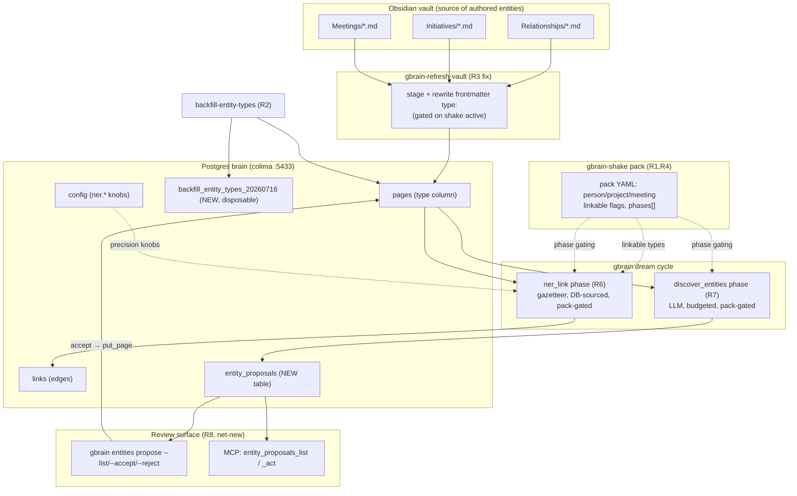
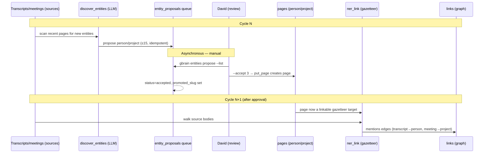

# Detailed Design — `gbrain-shake` Entity Schema Pack + Entity Extraction

**Status:** DRAFT — load-bearing sections (Overview → Data Models) written for review.
Error Handling, Testing Strategy, and Appendices follow after checkpoint.

**Branch:** `feat/entity-schema-pack` (gbrain-src)
**Author:** PDD process, 2026-07-16
**Related:** `../idea-honing.md` (decisions Q1–Q6), `../research/*.md` (R3–R7 + synthesis)

---

## 1. Overview

David Wu's gbrain has 4,282 pages, 100% embedding coverage — and **zero graph edges**.
The active schema pack (`gbrain-base-v2`) is a YC startup/investor ontology whose link
verbs and entity types (`person`, `company`, `deal`, `meeting`, `founded`, `invested_in`,
`works_at`…) don't match a transcript + PKM knowledge brain built from Slack, Outlook,
sessions, and an Obsidian vault. The ~57 hand-authored entity pages (relationships,
initiatives, meetings) import as `type: concept`, so the mention gazetteer — which only
reads `type IN ('person','company','organization','entity')` — never sees them, and no
transcript ever links to a person or project.

This project ships **`gbrain-shake`**: a domain-matched schema pack plus the entity-linking
and entity-discovery machinery that turns the flat page store into an actual graph.

**Outcomes:**
1. Transcripts, emails, and meetings link to the people and projects they mention
   (`mentions` edges), and meetings link to attendees (`attended` edges).
2. New people/projects surfaced in transcripts are proposed to a review queue; on approval
   they become entity pages that future linking passes attach to — a growth loop.
3. The whole feature is reversible and gated: activate the pack → typing + linking + discovery
   turn on; deactivate → clean revert.

**Non-goals (v1):** organization/company as a hand-authored linkable type (deferred v2);
retrofitting the broken `take_proposals` review path (we build a parallel entity path);
CJK entity handling; auto-promotion of discovered entities (review is always manual).

---

## 2. Detailed Requirements

Consolidated from `idea-honing.md`. Each is testable.

### R1 — Schema pack `gbrain-shake`
- R1.1 Declares `person`, `project`, `meeting` page types; `extends: gbrain-base-v2`.
- R1.2 `person` and `project` are marked `linkable: true` (new manifest field, see R4);
  `meeting` is `linkable: false` (source page, not a gazetteer target).
- R1.3 `meeting` retains outbound `attended` edges (meeting→person via `attendees:`
  frontmatter). This is hardcoded in link-extraction.ts and pack-independent; the pack only
  needs to declare the `meeting` type so pages aren't demoted to `note`.
- R1.4 Declares the `discover_entities` and `ner_link` phases in its `phases:` list.
- R1.5 `path_prefixes` map vault folders to types (person←relationships, project←initiatives,
  meeting←meetings) — used at import when subfolder structure is preserved (see R6).

### R1b — Corpus-matched type set (CRITICAL — data-loss guard)
Because `extends` does NOT merge at runtime (T20 unshipped; resolved manifest = child alone),
`gbrain-shake` MUST declare the FULL type set it wants active, not just the 3 entity types.
Verified against base-v2 + live corpus:
- R1b.1 **Declare the real generated types base-v2 omits:** `session` (2,711 pages),
  `slack-channel` (103), `action` (39), `brag-book` (9) — **2,862 pages, 67% of the brain.**
  base-v2's `*unknown*→note` catch-all (gbrain-base-v2.yaml:~555) would RETYPE all of these to
  `note` (preserving only `legacy_type`) on any `unify-types` pass. Declaring them prevents
  silent flattening of the majority of the corpus.
- R1b.2 **Fix slack typing:** base-v2's `slack` type has aliases `slack-message`/`slack-thread`
  only — NOT `slack-channel` (the actual stored type of David's 103 slack pages). Either add
  `slack-channel` as an alias of `slack`, or declare `slack-channel` as its own type.
  Decision: add as alias of `slack` (keeps one temporal Slack type; less schema surface).
- R1b.3 **Drop irrelevant VC/social types:** do NOT carry `deal`, `tweet`, `social-digest`
  into gbrain-shake (VC/social-media artifacts; 0 pages, 0 relevance to Amazon PE work).
- R1b.4 **Carry forward the still-relevant base-v2 types** the corpus uses: `concept` (494),
  `note` (290), `email` (633), plus `atom`, `media`, `source`, `analysis`, `writing`, `event`,
  `diary`, `person`, `project` (already needed). Net: gbrain-shake is the complete
  corpus-matched taxonomy, minus VC cruft, plus the 3 entity types + real generated types.
- R1b.5 **Keep the catch-all retype rule** (`*unknown*→note`) as a safety net for genuinely
  unknown future types — but with the real types now declared, it stops firing on the corpus.
- R1b.6 Preserve base-v2's `link_types`/`frontmatter_links` David's graph actually uses
  (mentions, relates_to, discusses, works_at, attended) — drop only the VC verbs
  (founded/invested_in/led_round/yc_partner/advises) if they're pure cruft (confirm in design
  of link_types section; harmless-inherited but cleaner to omit under no-merge).

### R2 — Backfill (reversible)
- R2.1 Re-type existing DB rows: `doppelganger-cortex/relationships__*` → person (~27),
  `initiatives__*` → project (~8), `meetings__*` → meeting (~22).
- R2.2 Snapshot every touched row `(id, slug, source_id, old_type, new_type, backfilled_at)`
  to `backfill_entity_types_20260716` BEFORE update.
- R2.3 `gbrain backfill-entity-types --dry-run | --apply | --revert`, idempotent.
- R2.4 `--revert` restores exact prior types from the snapshot.

### R3 — Collector fix (durable typing)
- R3.1 Vault re-sync must keep entity pages correctly typed (else re-import reverts to concept).
- R3.2 Mechanism: `gbrain-refresh-vault` rewrites frontmatter `type:` during staging, gated on
  `gbrain-shake` being the active pack.
- R3.3 When pack is inactive, collector behavior is unchanged (no typing).

### R4 — Pack-aware linkable types (TODO-1)
- R4.1 New `linkable: boolean` field on PageTypeSchema (default false), mirroring the existing
  `expert_routing` / `extractable` per-type booleans.
- R4.2 `buildGazetteer` and `buildTargetTypeMap` (by-mention.ts) + the twin type filter in
  extract-ner.ts read linkable types from the active pack manifest, not a hardcoded const.
- R4.3 Base packs (`gbrain-base`, `gbrain-base-v2`) mark person/company/organization/entity
  `linkable: true` so pre-existing behavior is byte-for-byte preserved.
- R4.4 The 4-type filter copies in onboard/checks, impact-capture, init-nudge, doctor are
  audited; those that gate *linking* move to the pack-aware helper, those that gate
  *expert-routing* are left alone.

### R5 — NER precision (config-driven)
- R5.1 `ner.allow_list` (JSON array) — force-include short handles (F2, Cue) below MIN_NAME_LENGTH.
- R5.2 `ner.ignore_list` (JSON array) — suppress ambiguous domain words (returns, fit, size,
  compatibility, discovery, signal…) unless the page title is an exact unambiguous match.
- R5.3 `ner.reject_first_names` (bool, default true) — a person target only links on a
  multi-token name or an explicit alias match; bare first names ("Mike") never link.
- R5.4 `MIN_NAME_LENGTH` stays 4; allow_list is the escape hatch.

### R6 — NER linking phase (`ner_link`)
- R6.1 New DB-sourced cycle phase wrapping `extractNerLinks`. Guards on `!engine` ONLY,
  never `brainDir`.
- R6.2 Pack-gated (only runs when active pack declares `ner_link` in `phases:`).
- R6.3 Writes `mentions` edges (link_kind typed_ner where verb-inferred) from any source page
  (transcript/email/meeting) to linkable entity pages. Idempotent (existing links UNIQUE
  constraint; ON CONFLICT DO NOTHING).

### R7 — Entity discovery phase (`discover_entities`)
- R7.1 New DB-sourced, pack-gated cycle phase. LLM (Bedrock Opus 4.8 via proxy).
- R7.2 Scans recent transcripts/meetings for NEW person/project entities not already pages.
- R7.3 Proposes to `entity_proposals` queue (never auto-creates pages).
- R7.4 Budget: `cycle.discover_entities.budget_usd` = $0.50/source/run; brain-wide $2.00 backstop.
- R7.5 Cap ≤15 new proposals/run. Idempotent via content_hash + prompt_version.
- R7.6 Proposes person + project ONLY. Org signals attach as an attribute on a person/project
  proposal, never as a `type=organization` page (Q1 gazetteer hazard).

### R8 — Review + promote surface (net-new; the take_proposals review half was never built)
- R8.1 `entity_proposals` table (status pending/accepted/rejected).
- R8.2 CLI: `gbrain entities propose --list [--status] `, `--accept N`, `--reject N`.
- R8.3 MCP tools: `entity_proposals_list`, `entity_proposals_act`.
- R8.4 Accept → `put_page` creates the person/project page (enters gazetteer next NER pass),
  stamps `promoted_slug`, status=accepted. Reject → status=rejected, never re-proposed.
- R8.5 D17 invariant: explicit accept is the ONLY path from queue to a real page.

### R9 — Reversibility / gating (whole feature)
- R9.1 Deactivating the pack turns off typing (collector), discovery + ner phases (pack-gated),
  and linkable-type widening (pack-aware). Backfill `--revert` restores DB types.
- R9.2 No orphaning: parent/pack choice can't null existing page types (schema_review_orphans
  counts only NULL/'' types; put_page type-check is soft-warn).

---

## 3. Architecture Overview

### 3.1 Where each piece lives



### 3.2 The growth loop (the heart of the design)



Key insight from research: discovery and linking are **decoupled by the manual accept gate**.
Discovery writes proposals; only after you accept does the entity become a gazetteer target;
the *next* NER pass links to it. Within a single cycle, `discover_entities` running before
`ner_link` does NOT link same-cycle (the gazetteer reads committed pages, not the queue) —
that's fine and correct.

### 3.3 Two independent edge sources

| Edge | Source page | Target | Mechanism | Pack dependency |
|------|-------------|--------|-----------|-----------------|
| `mentions` | any (transcript/email/meeting) | person, project | `ner_link` phase, gazetteer body scan | linkable types (R4) |
| `attended` | meeting | person | hardcoded FRONTMATTER_LINK_MAP (attendees:) | just needs `meeting` type declared |

The `attended` path is pack-independent (hardcoded in link-extraction.ts:703/792) — it fires
at ingest for any `type:meeting` page with `attendees:`. We get it "for free" once meetings
are typed correctly (R2 backfill + R3 collector).

### 3.4 Dual-engine constraint

Live brain is Postgres (GBRAIN_DATABASE_URL), but the codebase supports PGLite too. Every new
table (`entity_proposals`) must be declared in FOUR places: `migrate.ts` (v123),
`src/schema.sql`, `pglite-schema.ts` template, and regenerated `schema-embedded.ts`. The
snapshot table is disposable (lazy CREATE), so it lives ONLY in the backfill command, not the
static schema.

---

## 4. Components and Interfaces

### C1 — Pack manifest `gbrain-shake.yaml`
- Location: `src/core/schema-pack/base/gbrain-shake.yaml`
- `extends: gbrain-base-v2`; declares person/project/meeting page types with `linkable` +
  `path_prefixes`; `phases: [discover_entities, ner_link]`.
- Interface: consumed by the registry (`resolvePack`) and the pack-gating check
  (`packDeclaresPhase`).

### C2 — `linkable` manifest field (R4 / TODO-1)
- `src/core/schema-pack/manifest-v1.ts`: add `linkable: z.boolean().default(false)` to
  PageTypeSchema.
- New helper `linkableTypesFromPack(engine): Promise<string[]>` (co-located with schema-pack).
- Rewire: `buildGazetteer` + `buildTargetTypeMap` (by-mention.ts), type filter in
  extract-ner.ts:206, to call the helper instead of the const `LINKABLE_ENTITY_TYPES`.
- Base parity: base + base-v2 YAML mark person/company/organization/entity `linkable: true`.

### C3 — `ner_link` cycle phase (R6)
- `src/core/cycle/ner-link.ts` — a `BaseCyclePhase` subclass wrapping `extractNerLinks`.
- Registered in `ALL_PHASES` (cycle.ts) after `discover_entities`; pack-gated; `!engine` guard.
- Reads NER precision knobs from config (R5).

### C4 — `discover_entities` cycle phase (R7)
- `src/core/cycle/discover-entities.ts` — `BaseCyclePhase`, LLM via gateway, budget-metered.
- Selects recent source pages, prompts Opus for new person/project entities, dedups against
  existing pages + pending proposals, writes to `entity_proposals`.

### C5 — `entity_proposals` table + repo (R8)
- Migration v123 (four-place). Engine methods on BrainEngine:
  `insertEntityProposal`, `listEntityProposals(status?)`, `actEntityProposal(id, action)`.

### C6 — Review CLI (R8)
- `src/commands/entities.ts` — `propose --list/--accept N/--reject N` subcommands.
- Accept calls `put_page` to create the entity page, then stamps the proposal.

### C7 — Review MCP tools (R8)
- `entity_proposals_list`, `entity_proposals_act` — mirror the shape of existing MCP list/act
  tools; wired into the MCP server surface.

### C8 — Backfill command (R2)
- `src/commands/backfill-entity-types.ts` — `--dry-run/--apply/--revert`, snapshot table,
  reuses backfill-base.ts idioms (keyset pagination, reserved connection, config checkpoint).

### C9 — Collector fix (R3)
- `~/.gbrain-bin/gbrain-refresh-vault` — during staging, if active pack == gbrain-shake,
  rewrite frontmatter `type:` per subfolder before `gbrain import`.

---

## 5. Data Models

### 5.1 `entity_proposals` (new table, v123)

```sql
CREATE TABLE entity_proposals (
  id                BIGSERIAL PRIMARY KEY,
  source_id         TEXT NOT NULL REFERENCES sources(id) ON DELETE CASCADE,
  source_page_slug  TEXT NOT NULL,              -- the page the entity was discovered in
  proposed_slug     TEXT NOT NULL,              -- canonical slug the entity would get
  proposed_type     TEXT NOT NULL CHECK (proposed_type IN ('person','project')),
  proposed_title    TEXT NOT NULL,
  proposed_aliases  JSONB NOT NULL DEFAULT '[]',-- alias list (JSONB, repo convention)
  org_hint          TEXT,                        -- Q1: org attached as attribute, not a page
  content_hash      TEXT NOT NULL,              -- SHA-256 of source body slice (idempotency)
  prompt_version    TEXT NOT NULL,              -- bump to invalidate cache
  proposal_run_id   TEXT NOT NULL,              -- bulk rollback / audit
  status            TEXT NOT NULL DEFAULT 'pending'
                      CHECK (status IN ('pending','accepted','rejected')),
  confidence        REAL,
  model_id          TEXT NOT NULL,
  proposed_at       TIMESTAMPTZ NOT NULL DEFAULT now(),
  acted_at          TIMESTAMPTZ,
  acted_by          TEXT,
  promoted_slug     TEXT,                        -- set on accept (differs from take's promoted_row_num)
  UNIQUE (source_id, source_page_slug, content_hash, prompt_version)
);
CREATE INDEX entity_proposals_pending_idx ON entity_proposals (source_id)
  WHERE status = 'pending';
CREATE INDEX entity_proposals_run_idx ON entity_proposals (proposal_run_id);
```

Differences from `take_proposals` (deliberate): `promoted_slug TEXT` (page, not fence row);
`proposed_type`/`proposed_title`/`proposed_aliases`/`org_hint` (entity shape, not claim text);
same idempotency-key discipline.

### 5.2 `backfill_entity_types_20260716` (disposable snapshot)

```sql
CREATE TABLE IF NOT EXISTS backfill_entity_types_20260716 (
  page_id       INTEGER PRIMARY KEY,
  slug          TEXT NOT NULL,
  source_id     TEXT NOT NULL,
  old_type      TEXT NOT NULL,
  new_type      TEXT NOT NULL,
  backfilled_at TIMESTAMPTZ NOT NULL DEFAULT now()
);
```
Not in static schema (lazy CREATE in the command). `--revert` = `UPDATE pages p SET type =
s.old_type FROM backfill_entity_types_20260716 s WHERE p.id = s.page_id`.

### 5.3 Config keys (new; `config` table, JSON values)

| Key | Type | Default | Purpose |
|-----|------|---------|---------|
| `ner.allow_list` | JSON array | `["F2","Cue"]` | force-include short handles |
| `ner.ignore_list` | JSON array | `["returns","fit","size","compatibility","discovery","signal"]` | suppress ambiguous domain words |
| `ner.reject_first_names` | "true"/"false" | `"true"` | require multi-token/alias for person links |
| `cycle.discover_entities.budget_usd` | number | `0.50` | per-source LLM cap |
| `cycle.discover_entities.max_proposals` | number | `15` | per-run proposal cap |

### 5.4 `links` (existing, unchanged shape)
`mentions` edges written by `ner_link` use existing columns; `link_kind='typed_ner'` when a
verb pattern matches, else plain mention. UNIQUE `(from_page_id, to_page_id, link_type,
link_source, origin_page_id)` gives idempotency.

### 5.5 PageTypeSchema (modified)
Add `linkable: boolean` (default false) alongside existing `expert_routing`, `extractable`.

---

## 6. Error Handling

Failure posture: this feature touches a live 4,282-page brain. Every mutating step is
**reversible, idempotent, and gated**. Ordered by blast radius.

### 6.1 Backfill (highest risk — mutates existing pages)
- **Snapshot-before-write invariant:** `--apply` MUST write the snapshot row before the
  UPDATE, in one transaction per batch. If snapshot insert fails, the UPDATE does not run.
- **Idempotent re-run:** `--apply` skips rows already present in the snapshot (a crash
  mid-run resumes safely). `--revert` is idempotent (restoring an already-restored type is a
  no-op).
- **Dry-run first:** `--apply` refuses to run unless a prior `--dry-run` count is shown, OR
  `--yes` is passed (mirrors backfill-base.ts + the takes `--yes` gate at takes.ts:620).
- **Partial failure:** batch N failing leaves batches <N applied + snapshotted; re-run
  resumes. `--revert` restores whatever is in the snapshot regardless of how far apply got.
- **Wrong-brain guard:** command asserts the expected source_id set exists before touching
  rows; aborts loud if the doppelganger-cortex slugs aren't found (don't silently no-op on
  the wrong DB).

### 6.2 Type-set / catch-all (data-loss guard — R1b)
- **Pre-activation check:** before `gbrain-shake` is set active, a validation step asserts
  every stored `pages.type` value in the corpus is either declared or aliased in the pack
  (query `SELECT DISTINCT type FROM pages` vs pack types+aliases). If any type is uncovered,
  ABORT activation with the list — because the `*unknown*→note` catch-all would flatten them.
  This is the guardrail that makes R1b enforceable, not just documented.
- The catch-all stays as a net for genuinely novel future types, but the pre-activation check
  guarantees it never fires on the existing 4,282 pages.

### 6.3 `discover_entities` (LLM, budgeted)
- **Budget exhaustion:** BudgetMeter caps at $0.50/source + $2.00/run; on cap hit, the phase
  stops cleanly, records partial results, returns status ok-with-partial (mirrors extract_atoms).
- **Proxy down:** the phase makes gateway chat calls; if the LiteLLM/Bedrock proxy is
  unreachable, the phase fails soft (logged, cycle continues) — same posture as the dream
  preflight we added to gbrain-daily. Discovery resumes next cycle.
- **Malformed LLM output:** proposals that don't parse to {slug,type,title} are dropped with a
  warn, not written. Never crash the cycle on a bad completion.
- **Idempotency:** UNIQUE (source_id, source_page_slug, content_hash, prompt_version) +
  ON CONFLICT DO NOTHING — a re-run over unchanged pages writes nothing, spends nothing.

### 6.4 `ner_link` (deterministic, gazetteer)
- **`!engine` guard only** (never `brainDir`) — the bug that FS-skipped the old extract phase.
- **Empty gazetteer:** if no linkable entity pages exist yet (fresh brain, pre-backfill), the
  phase is a clean no-op (0 edges), not an error.
- **Link idempotency:** existing links UNIQUE constraint + ON CONFLICT DO NOTHING; re-running
  NER never duplicates edges.
- **Precision-knob misconfig:** if `ner.allow_list`/`ner.ignore_list` config is malformed
  JSON, fall back to defaults + warn (don't crash; don't silently disable the guard).

### 6.5 Review / promote (accept → put_page)
- **Accept is transactional:** create page via put_page AND stamp proposal
  (status=accepted, promoted_slug) in one transaction. If put_page fails, proposal stays
  pending (retryable).
- **Double-accept:** accepting an already-accepted proposal is rejected with a clear message
  (status check), not a duplicate page.
- **Slug collision:** if the proposed slug already exists (entity authored meanwhile), accept
  surfaces the conflict and asks to merge/alias rather than overwrite (respects the
  "never overwrite existing page" invariant from put_page).

### 6.6 Dual-engine / migration
- **Four-place table declaration** (migrate.ts, schema.sql, pglite-schema.ts,
  schema-embedded.ts) verified by a test that fresh-installs both engines and asserts
  `entity_proposals` exists (§7.4). Missing any place = fresh-install breakage, caught in CI.

---

## 7. Testing Strategy

TDD per PDD implementation plan: tests written with each increment. Coverage by component.

### 7.1 Pack manifest (R1, R1b)
- Unit: `gbrain-shake.yaml` loads + validates against manifest-v1 schema; declares
  person/project/meeting with correct `linkable` flags; declares session/slack-channel/
  action/brag-book; slack aliases include slack-channel; does NOT declare deal/tweet/social-digest.
- **Corpus-coverage test (the R1b guard):** assert every `DISTINCT type` in a fixture
  representative of the live corpus is covered by pack types+aliases → the pre-activation check.
- Lens-pack manifest test updated (research flagged lens-pack-manifests.test.ts asserts each
  pack's own declarations).

### 7.2 `linkable` field + gazetteer rewire (R4)
- Unit: `linkableTypesFromPack` returns person/project for shake, person/company/organization/
  entity for base-v2 (parity — pre-existing behavior byte-for-byte).
- Integration: `buildGazetteer` + extract-ner.ts twin filter both read the pack helper; a
  project-typed page becomes a gazetteer target under shake, is NOT under base-v2.
- Regression: base-v2 gazetteer output unchanged (the parity guarantee).

### 7.3 NER precision (R5)
- Unit per knob: allow_list forces "F2"/"Cue" through the MIN_NAME_LENGTH=4 floor;
  ignore_list suppresses "returns"/"fit" unless exact-title match; reject_first_names blocks
  bare "Mike" but allows "Mike Stuck"/"mikstuck" alias.
- Malformed-config fallback test.

### 7.4 Migration + dual engine (§6.6)
- Fresh Postgres install → entity_proposals exists with correct DDL.
- Fresh PGLite install → same.
- Migration v123 applied to a v122 DB → table added, idempotent on re-run.

### 7.5 `ner_link` phase (R6)
- Integration: fixture brain with 1 person page + 3 transcripts mentioning them by full name →
  phase creates 3 mentions edges; re-run creates 0 (idempotent).
- `!engine` guard: phase runs on a DB brain with no checkout (the exact case the old extract
  phase failed); asserts it does NOT skip with no_brain_dir.
- Meeting→person via attended (hardcoded) + meeting→project via mentions both fire on a
  fixture meeting page.

### 7.6 `discover_entities` phase (R7)
- Integration with a stubbed gateway: proposes new person/project from a fixture transcript;
  respects max_proposals cap; dedups against existing pages + pending proposals; idempotent on
  re-run (content_hash); does NOT emit type=organization (org→org_hint attribute only).
- Budget cap enforced (stubbed meter).

### 7.7 Review / promote (R8)
- CLI: `--list` shows pending; `--accept N` creates the page (verify via get) + stamps
  promoted_slug + status=accepted; `--reject N` marks rejected + not re-proposed next run.
- Accept transactionality: put_page failure leaves proposal pending.
- Slug-collision path.
- MCP `entity_proposals_list`/`_act` parity with CLI.

### 7.8 Backfill (R2) + reversibility
- `--dry-run` reports N without writing.
- `--apply` re-types the fixture entity pages + writes snapshot; `--revert` restores exact
  old types; round-trip leaves pages identical to start.
- Crash-resume: kill mid-apply, re-run, no double-processing.

### 7.9 End-to-end (the growth loop, §3.2)
- Seed brain → backfill types → activate shake → run cycle → discover proposes → accept →
  next cycle NER links transcripts to the accepted entity. Assert edges appear only after
  accept (the decoupling invariant).

### 7.10 ALL_PHASES pinning tests (research-flagged)
- Update cycle.serial.test.ts:202, autopilot-global-maintenance.test.ts:32-43,
  lens-pack-manifests.test.ts to include the two new phases in the expected ordering.

---

## 8. Appendices

### 8.A Technology / mechanism choices

| Choice | Decision | Rationale | Alt rejected |
|--------|----------|-----------|--------------|
| Pack parent | `extends: gbrain-base-v2` | corpus already typed under v2's canonical set; active pack; merge-safe if T20 lands | base (39-type YC sprawl); standalone (loses successor lineage) |
| Linkable widening | pack-aware `linkable` flag (TODO-1) | scopes project-linking to shake; fits expert_routing/extractable pattern | const-append (global, leaks to all packs) |
| Type set | full corpus-matched taxonomy in child | extends doesn't merge at runtime; declaring only 3 types would flatten 67% of brain via `*unknown*→note` | 3-types-on-base (data-loss) |
| slack-channel | alias of `slack` | one temporal type, less surface | own type (more schema) |
| Discovery review | full net-new accept/promote path | take_proposals review half was never coded | mirror (nothing to mirror); auto-accept (false-entity pollution) |
| Backfill reversibility | snapshot table + --revert | one-time data op, exact restore, out of static schema | migration (wrong scope, ships to all brains); tag rows (pollutes pages) |
| meeting | typed, `linkable:false`, source-only | meetings referenced generically, not name-mentioned; keeps attended outbound edges | linkable (garbage edges on date-titles) |
| org/company | deferred to v2 | 0 authored pages; common-word false-positive risk; latently gazetteer-linkable (hazard) | declare now (dead schema + noise) |

### 8.B Key research findings (see research/*.md for full detail + citations)

1. **extends does NOT merge at runtime** (registry.ts:277; T20 unshipped) → child pack carries
   full taxonomy. Drives R1b + the full-type-set decision.
2. **take_proposals review path was never built** (propose side only; 17 rows stuck pending) →
   R8 is net-new, not a mirror.
3. **path_prefixes DOES set stored type at import** (markdown.ts:135) but the collector
   flattens subfolders (`sed 's|/|__|g'`), breaking the match → collector fix rewrites
   frontmatter type instead (R3). Gazetteer QUERY path remains hardcoded-type-only (→ R4).
4. **`*unknown*→note` catch-all** (base-v2:~555) would retype 2,862 undeclared-type pages →
   R1b data-loss guard + §6.2 pre-activation check.
5. **attended edge is hardcoded, pack-independent** (link-extraction.ts:703/792) → meeting
   only needs to be a declared type; no verb re-declaration.
6. **New tables need 4-place declaration** (migrate.ts + schema.sql + pglite-schema.ts +
   schema-embedded.ts) → §6.6 + §7.4.
7. **NER is CLI-only** today → wrap extractNerLinks as a DB cycle phase (R6).
8. **entity-type filter has a twin** in extract-ner.ts:206 besides by-mention.ts:33 → both
   move to the pack-aware helper (R4.2).

### 8.C Alternative approaches considered
- **Just fix the score, don't build the graph:** rejected — user explicitly wants a real
  entity graph; embeddings-only retrieval leaves the "who/what is connected" queries unanswered.
- **Switch to a bundled pack:** rejected — none matches (creator=atoms, investor=deals,
  engineer=code). gbrain-shake is the corpus-matched pack.
- **Auto-create discovered entities:** rejected — false-entity pollution of the gazetteer;
  manual review is the precision gate (D17).

### 8.D Open items deferred to implementation/v2
- org/company as a linkable type (v2, once discovery yields a clean org sample).
- Fixing the upstream take_proposals review path (out of scope; we build the entity path).
- CJK entity handling (English-dominant corpus; existing MIN_NAME_LENGTH TODO).
- Whether to upstream the `linkable` flag / pack-aware gazetteer to the gbrain project.

