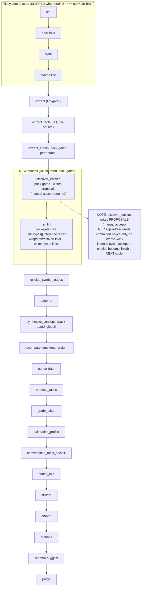

# Cycle phase registration — how to add `discover_entities` + a NER phase

Research for the entity-schema-pack PDD. Read-only investigation; no code changed.
All citations are `file:line` against branch `feat/entity-schema-pack`.

Two new phases are proposed:

1. **`discover_entities`** — pack-gated. Proposes new entity pages (writes to a
   review queue / proposals; requires manual accept).
2. **`ner_link`** (working name; NER linking) — wraps `extractNerLinks`
   (`src/core/extract-ner.ts:100`) as a cycle phase. Must run **after** any
   entity creation so freshly-created entities are in the gazetteer.

Key ordering constraint (from the task brief, confirmed by the code):
`discover_entities` writes **proposals** that require **manual accept**, so
within a single cycle `discover_entities → ner_link` only helps entities that
were accepted on a *prior* cycle. NER reads the gazetteer built from committed
`pages` rows (`buildGazetteer` in `src/core/by-mention.ts`, called at
`src/core/extract-ner.ts:118`), not from the pending proposal queue. So the
ordering is correct for steady-state (accept lands between cycles) but is NOT a
same-cycle create→link pipeline.

---

## 1. ALL_PHASES + CyclePhase type

- `CyclePhase` union: `src/core/cycle.ts:57-99`.
- `ALL_PHASES` array (execution order): `src/core/cycle.ts:101-186`.
- `PHASE_SCOPE` taxonomy (`source` | `global` | `mixed`): `src/core/cycle.ts:209-243`.
- `GLOBAL_PHASES` / `NON_GLOBAL_PHASES` derived from `PHASE_SCOPE`: `src/core/cycle.ts:258-259`.
- `NEEDS_LOCK_PHASES` set (which phases acquire the cycle lock): `src/core/cycle.ts:272-308`.

Current ordered pipeline (semantic rationale is documented inline at the top of
`cycle.ts:13-28` and per-phase in the `ALL_PHASES` comments):

```
lint → backlinks → sync → synthesize → extract → extract_facts →
extract_atoms(pack-gated) → resolve_symbol_edges → patterns →
synthesize_concepts(pack-gated) → recompute_emotional_weight → consolidate →
propose_takes → grade_takes → calibration_profile →
conversation_facts_backfill → enrich_thin → skillopt →
embed → orphans → schema-suggest → purge
```

### Where the two new phases slot in

**`discover_entities`** — it CREATES entity pages (mutates the graph, writes
proposals), so it must run:
- AFTER `extract_facts` (fresh fact context, same rationale extract_atoms uses at `cycle.ts:113-118`),
- ideally adjacent to / just after `extract_atoms` (both are pack-gated per-source content-derivation phases),
- BEFORE `patterns`/`synthesize_concepts` so downstream aggregation sees new entities on the *next* cycle.

Recommended slot: **immediately after `extract_atoms`** (line 118 in `ALL_PHASES`), before `resolve_symbol_edges`.

**`ner_link`** — reads the gazetteer of committed entity pages and writes typed
links. It must run AFTER entity creation is materialized. Because
`discover_entities` only writes *proposals* (manual accept), NER links against
whatever entities are already committed. Two viable slots:
- After `extract` / `extract_facts` (link materialization neighborhood — NER is a links pass, conceptually a sibling of the `extract` links pass), OR
- After `discover_entities` in the pipeline for ordering clarity.

Recommended slot: **right after `discover_entities`** so the pipeline reads
`... extract_facts → extract_atoms → discover_entities → ner_link → resolve_symbol_edges → patterns ...`.
This is source-scoped work; NER walks pages and writes links (see scope note below).

### Guardrail: three tests pin ALL_PHASES — update all three

Adding an entry to `ALL_PHASES` will fail these unless updated:

1. `test/core/cycle.serial.test.ts:202` — `expect(report.phases.map(p => p.phase)).toEqual(ALL_PHASES)`. The runCycle dispatch order MUST match `ALL_PHASES` exactly.
2. `test/autopilot-global-maintenance.test.ts:32-37` — `GLOBAL_PHASES ∪ NON_GLOBAL_PHASES == ALL_PHASES`, no overlap. Adding a phase to `ALL_PHASES` requires a `PHASE_SCOPE` entry (the `Record<CyclePhase, PhaseScope>` is exhaustive — TS compile error otherwise).
3. `test/lens-pack-manifests.test.ts:85-87,211-212` — pins that `gbrain-creator` and `gbrain-everything` declare exactly `[extract_atoms, synthesize_concepts]`. If `discover_entities` is added to a pack's `phases:`, update these assertions.

---

## 2. Pack-gating mechanism

The gate is `packDeclaresPhase(engine, phase)` at **`src/core/cycle.ts:867-881`**:

```ts
export async function packDeclaresPhase(engine, phase): Promise<boolean> {
  try {
    const { loadActivePack } = await import('./schema-pack/load-active.ts');
    const { loadConfig } = await import('./config.ts');
    const cfg = loadConfig();
    const resolved = await loadActivePack({ cfg, remote: false });
    const phases = resolved.manifest.phases ?? [];
    return phases.includes(phase);
  } catch {
    return false;   // fail-open-to-SKIP: unknown pack → don't run the gated phase
  }
}
```

- Reads the ACTIVE pack's `phases:` list **only** — NOT the `extends` chain, NOT
  `borrow_from` targets. Phases are declared locally per pack (design note
  `cycle.ts:847-865`). This is why `gbrain-everything` re-declares creator's
  phases verbatim (`gbrain-everything.yaml:71-73`).
- Manifest schema: `phases: z.array(z.string().min(1)).optional()` at
  `src/core/schema-pack/manifest-v1.ts:361` (doc comment 346-351).
- `gbrain-creator.yaml:67-69` declares `phases: [extract_atoms, synthesize_concepts]`.
  Comment at `gbrain-creator.yaml:65-66`: pre-existing core phases ALWAYS run;
  `phases:` is **additive, not subtractive**.

### The exact skip check + message

In `runCycle`, for `extract_atoms` (`src/core/cycle.ts:1778-1801`):

```ts
if (phases.includes('extract_atoms')) {
  checkAborted(opts.signal);
  if (!engine) {
    phaseResults.push({ phase: 'extract_atoms', status: 'skipped', ...,
      details: { reason: 'no_database' } });
  } else if (!(await packDeclaresPhase(engine, 'extract_atoms'))) {
    phaseResults.push({
      phase: 'extract_atoms',
      status: 'skipped',
      summary: 'extract_atoms: active pack does not declare this phase (...)',
      details: { reason: 'not_in_active_pack', pack_gated: true },   // greppable marker
    });
  } else {
    // ... real dispatch to runPhaseExtractAtoms ...
  }
}
```

`synthesize_concepts` uses the identical shape at `src/core/cycle.ts:1893-1914`
(skip message "synthesize_concepts: active pack does not declare this phase",
`details: { reason: 'not_in_active_pack', pack_gated: true }`).

`packDeclaresPhase` is also consumed by doctor (`src/commands/doctor.ts:3185-3187`,
backlog check) and autopilot (`src/commands/autopilot.ts:706-710`).

---

## 3. Phase runner shape

Two contract styles coexist. New phases should use **BaseCyclePhase**.

### BaseCyclePhase contract — `src/core/cycle/base-phase.ts:60-200`

A subclass MUST provide:

- `readonly name: CyclePhase` — must match a `CyclePhase` enum entry (`base-phase.ts:62`).
- `protected readonly budgetUsdKey: string` — config key, e.g. `cycle.discover_entities.budget_usd` (`base-phase.ts:65`).
- `protected readonly budgetUsdDefault: number` (`base-phase.ts:68`).
- `protected async process(engine, scope, ctx, opts)` returning `{ summary, details, status? }` (`base-phase.ts:75-84`). **This is the only method that does real work.**

The base `run(ctx, opts)` (`base-phase.ts:157-199`) wraps `process()` with the
five cross-cutting concerns (`base-phase.ts:8-25`):

1. **Uniform signature** `run(ctx, opts) → PhaseResult`.
2. **Source-scope enforcement** — `scope = sourceScopeOpts(ctx)` (`base-phase.ts:162`) is the ONLY sanctioned way to read source-scoped data; subclass gets `ScopedReadOpts` ({sourceId?, sourceIds?}) and must thread it into every engine call. Forgetting it is a compile error, not a runtime cross-source leak (closes the v0.34.1 leak class).
3. **Budget metering** — base constructs a `BudgetMeter` from `budgetUsdKey`/`budgetUsdDefault` (`base-phase.ts:164-170`). Subclass calls `this.checkBudget(estimate)` before every LLM submit (`base-phase.ts:118-130`); on `allowed=false` it MUST abort the planned submit and return what it has with `status: 'warn'` + `details.budget_exhausted: true` (clean partial completion, NOT failure).
4. **Error envelope** — thrown errors caught and mapped to `status: 'fail'` with `error.code`/`error.class` (overridable via `mapErrorCode`/`mapErrorClass`, `base-phase.ts:91-101`).
5. **Progress** — subclass calls `this.tick(opts, msg)` (`base-phase.ts:107-110`), never touches the reporter directly.

Optional overrides: `mapErrorCode` / `mapErrorClass`.

**Reference implementation:** `ProposeTakesPhase` in
`src/core/cycle/propose-takes.ts:286-454`, exposed via the thin wrapper
`runPhaseProposeTakes(ctx, opts)` at `propose-takes.ts:460-465`. It walks
`engine.listPages({ ...scope, ... })` (source-scoped via the spread of `scope`,
`propose-takes.ts:322-327`), idempotency-checks per page, budget-checks
(`propose-takes.ts:361-372`), calls an injected/default LLM extractor, writes
rows, then returns `{ summary, details, status }`. Note the budget-exhausted
path: sets `result.budget_exhausted`, `break`s the loop, returns `status: 'warn'`
(`propose-takes.ts:366-372, 451`).

### BudgetMeter — `src/core/cycle/budget-meter.ts`

- `check(estimate: SubmitEstimate): BudgetCheckResult` at `budget-meter.ts:89-173`.
- `SubmitEstimate` = `{ modelId, estimatedInputTokens, maxOutputTokens, label? }` (`budget-meter.ts:37-46`).
- Non-Anthropic/unpriced models bypass the gate with a warn-once (`budget-meter.ts:92-119`); budget `<= 0` disables the gate (`budget-meter.ts:122-136`).
- Writes an audit JSONL line per submit to `~/.gbrain/audit/dream-budget-YYYY-Www.jsonl`.

### Source-scoping (PHASE_SCOPE)

`PHASE_SCOPE: Record<CyclePhase, PhaseScope>` at `cycle.ts:210-243` — exhaustive
map (TS forces an entry for every new `CyclePhase`). Recommended entries:
- `discover_entities: 'source'` (per-source content-derivation, like `extract_atoms`).
- `ner_link: 'source'` — NER walks pages and writes links per source. **Caveat:** `extractNerLinks` builds a **brain-wide** gazetteer (`extract-ner.ts:118`) even though the walk can be `sourceIdFilter`-scoped. That crosses sources for the gazetteer only (reads, not writes). If strict per-source isolation matters, treat it as `'mixed'` and document it like `synthesize`/`patterns` at `cycle.ts:200-204`.

### Abort handling + lock refresh

- `checkAborted(opts.signal)` is called at the top of each phase block (`cycle.ts:723-730`, invoked e.g. `cycle.ts:1779`). Long phases receive `yieldDuringPhase = buildYieldDuringPhase(lock, opts.yieldDuringPhase)` (`cycle.ts:661-683`) which refreshes the 5-min cycle DB lock (`cycle.ts:500`) mid-phase and renews the Minion job lock. `extract_atoms` threads it at `cycle.ts:1821`; a new long/LLM phase should do the same.
- Add new mutating phases to `NEEDS_LOCK_PHASES` (`cycle.ts:272-308`) so a `--phase discover_entities` run acquires the cycle lock.

---

## 4. Is NER already invokable as a phase, or only CLI? (CONFIRMED: CLI only)

**Confirmed: NER is NOT wired as a cycle phase.** Evidence:
- `grep discover_entities` over `src/` + `test/` → **zero hits**.
- `grep` for `'ner'`/`extractNerLinks` in `src/core/cycle*` / `src/core/cycle/` → **zero hits** (NER never imported by the orchestrator).
- No `ner` member in the `CyclePhase` union (`cycle.ts:57-99`) or `ALL_PHASES` (`cycle.ts:101-186`).

NER exists ONLY as a CLI mode:
- CLI flag parsed: `const ner = args.includes('--ner')` at `src/commands/extract.ts:688`.
- DB-source-only gate + fix-hint: `extract.ts:778-794` (rejects `--source fs`; rejects `timeline` subcommand).
- Dispatch: `extract.ts:881-896` — imports `extractNerLinks` from `../core/extract-ner.ts`, runs it with a shared gazetteer (co-run with `--by-mention`).
- Core library: `extractNerLinks(engine, opts)` at `src/core/extract-ner.ts:100-194`.

### What it takes to wrap `extractNerLinks` as a cycle phase

`extractNerLinks` is already a clean, engine-taking library function
(`extract-ner.ts:100-194`) returning `{ pages, created, pack_unavailable }`
(`extract-ner.ts:42-49`). It:
- is best-effort wrt the pack: returns `pack_unavailable: true` + 0 created when the active pack has no `link_types[].inference.regex` (`extract-ner.ts:107-116`). This is a natural pack-gate signal.
- accepts `sourceIdFilter`, `typeFilter`, `since`, `dryRun`, `gazetteer`, `onProgress` (`extract-ner.ts:24-40`).

Two implementation options:

**Option A (recommended) — new thin phase module** `src/core/cycle/ner-link.ts`:
- Preferred shape: subclass `BaseCyclePhase` for budget/scope/error uniformity, OR (simpler, since NER has no LLM cost — it's pure regex over a gazetteer) a plain `runPhaseNerLink(engine, opts): Promise<PhaseResult>` mirroring `runPhaseExtractFacts` (`cycle.ts:1011-1103`). NER has **no LLM spend**, so BudgetMeter is optional; a plain runner is the lighter fit and matches `runPhaseResolveSymbolEdges` (`cycle.ts:1116-1170`), another DB-only, non-LLM phase.
- Map `extractNerLinks` result → `PhaseResult`: `status: 'ok'` (or `'skipped'` when `pack_unavailable`), `summary: '${created} typed NER link(s) across ${pages} page(s)'`, `details: { created, pages, pack_unavailable }`.
- Thread `sourceIdFilter = cycleSourceId ?? 'default'`, `dryRun`, and `since` (for incremental) as the `extract`/`extract_facts` phases do.
- Register in `CyclePhase`, `ALL_PHASES`, `PHASE_SCOPE`, `NEEDS_LOCK_PHASES`, add the dispatch block in `runCycle`.

**Option B — DB-NER sub-step inside the existing `extract` phase.** REJECTED for
this DB brain: the `extract` phase is filesystem-gated and is SKIPPED on a
checkout-less/DB brain (see §5). Folding NER into `extract` would inherit that
skip and never run. The new NER phase must be DB-sourced and independent of
`brainDir`.

`discover_entities` has no existing library equivalent (unlike NER). It is
net-new: it needs an entity-proposal writer (analogous to how `propose_takes`
writes to the `take_proposals` queue at `propose-takes.ts:392-415`). Model it on
`ProposeTakesPhase` (BaseCyclePhase, LLM extractor, proposals-to-queue, manual
accept). It IS LLM-driven, so BudgetMeter applies.

---

## 5. Why the `extract` phase is skipped on a DB / checkout-less brain

`runCycle` guards every filesystem phase with `if (brainDir === null)` and pushes
`skipNoBrainDir(phase)`:

- `skipNoBrainDir` helper: `src/core/cycle.ts:1423-1430` — `status: 'skipped'`,
  summary `"requires a local brain directory; this brain has no on-disk checkout
  (postgres/remote engine); pass --dir <path> to run filesystem phases"`,
  `details: { reason: 'no_brain_dir' }`.
- `extract` phase specifically: `src/core/cycle.ts:1692-1715` — `else if (brainDir === null) { phaseResults.push(skipNoBrainDir('extract')); }`.
- `brainDir` comes from `opts.brainDir` (`cycle.ts:1420`); it is `null` when the brain has no on-disk git checkout (postgres/remote engine) — documented on `CycleOpts.brainDir` at `cycle.ts:414-420`.

`runPhaseExtract` itself (`cycle.ts:953-1009`) walks the filesystem via
`runExtractCore(engine, { dir: brainDir, ... })` — inherently FS-bound, hence the
skip. Same FS-skip applies to `lint`, `backlinks`, `sync`, `synthesize`,
`patterns`.

**Implication for the new NER phase:** it must NOT be `brainDir`-gated.
`extractNerLinks` already reads pages from the engine (`listAllPageRefs` +
`getPage`, `extract-ner.ts:128-153`) — no filesystem. So the NER phase's dispatch
block should follow the `extract_facts` pattern (`cycle.ts:1724-1764`), which is
DB-sourced and runs even when `brainDir === null` (it only guards on `!engine`,
never on `brainDir === null`). `discover_entities` likewise should be DB-sourced
(guard on `!engine` + pack gate only).

---

## Phase pipeline diagram (with the two new phases)



---

## Exact code changes to register a pack-gated phase (checklist)

Using `discover_entities` as the worked example (NER `ner_link` is identical minus the LLM/budget bits):

1. **`src/core/cycle.ts:57-99`** — add `| 'discover_entities' | 'ner_link'` to the `CyclePhase` union (with an explanatory comment block like the `extract_atoms` one at 72-81).
2. **`src/core/cycle.ts:101-186`** — insert `'discover_entities'` and `'ner_link'` into `ALL_PHASES` at the chosen positions (after `'extract_atoms'` line 118), with ordering-rationale comments. **Position MUST match the runCycle dispatch order** (pinned by `cycle.serial.test.ts:202`).
3. **`src/core/cycle.ts:210-243`** — add `discover_entities: 'source'` and `ner_link: 'source'` to `PHASE_SCOPE` (exhaustive `Record` — TS compile error if omitted). This auto-populates `GLOBAL_PHASES`/`NON_GLOBAL_PHASES`.
4. **`src/core/cycle.ts:272-308`** — add both to `NEEDS_LOCK_PHASES` (both mutate DB — proposals / links).
5. **New module** `src/core/cycle/discover-entities.ts` — `BaseCyclePhase` subclass (`name`, `budgetUsdKey='cycle.discover_entities.budget_usd'`, `budgetUsdDefault`, `process()`), plus `export async function runPhaseDiscoverEntities(ctx, opts)`. Model on `src/core/cycle/propose-takes.ts:286-465`. For `ner_link`, new module `src/core/cycle/ner-link.ts` wrapping `extractNerLinks` (plain `runPhaseNerLink(engine, opts)` runner is sufficient — no LLM cost).
6. **`src/core/cycle.ts` runCycle body** — add a dispatch block for each. Copy the `extract_atoms` block (`cycle.ts:1778-1831`) verbatim for the pack-gated shape:
   - `if (phases.includes('discover_entities')) { checkAborted(...); if (!engine) {skip no_database} else if (!(await packDeclaresPhase(engine, 'discover_entities'))) {skip reason:'not_in_active_pack', pack_gated:true} else { dispatch } }`.
   - Guard on `!engine` only — do NOT add `brainDir === null` skip (must run on DB brains, per §5). Thread `cycleSourceId ?? 'default'`, `dryRun`, `buildYieldDuringPhase(lock, opts.yieldDuringPhase)`, and `progress`.
7. **Pack manifest** — add `discover_entities` (and/or `ner_link`) to the `phases:` list of the entity pack YAML (mirror `gbrain-creator.yaml:67-69`). If added to an existing pack (`gbrain-everything`), re-declare explicitly (borrow_from does NOT borrow phases).
8. **Manifest schema** — no change needed: `phases: z.array(z.string())` at `manifest-v1.ts:361` accepts any string.
9. **Tests to update:** `cycle.serial.test.ts:202` (ALL_PHASES order), `autopilot-global-maintenance.test.ts:32-43` (auto-passes via PHASE_SCOPE), `lens-pack-manifests.test.ts:85-87 / 211-212` (if a bundled pack's `phases:` changes). Optionally add a doctor backlog check like `doctor.ts:3185-3187`.

If a phase should be gated on something other than the pack (e.g. NER's
`link_types[].inference.regex` availability), the phase body can additionally
short-circuit: `extractNerLinks` already returns `pack_unavailable: true`
(`extract-ner.ts:107-116`) which the wrapper maps to `status: 'skipped'`.
